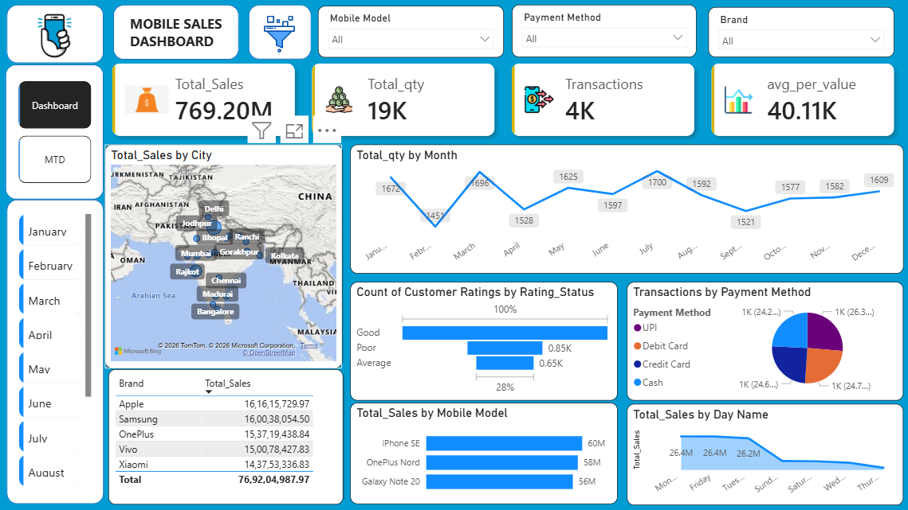

 📊 Mobile Sales Dashboard – Power BI

 📌 Project Overview

This project presents an **interactive Mobile Sales Dashboard** built using **Power BI**.
The dashboard analyzes mobile phone sales data across different **cities, brands, payment methods, and months** to generate useful business insights.

The goal of this project is to demonstrate **data analysis, visualization, and dashboard design skills** using Power BI.

 🎯 Project Objectives

* Analyze **overall mobile sales performance**
* Track **monthly sales trends**
* Identify **top-performing brands and models**
* Understand **customer rating patterns**
* Analyze **payment method preferences**
* Compare **sales across different cities**

 🛠 Tools & Technologies Used

* **Power BI**
* **Microsoft Excel**
* **Data Cleaning**
* **Data Visualization**
* **DAX (Data Analysis Expressions)**

 📊 Key Dashboard Metrics

| Metric                    | Value   |
| ------------------------- | ------- |
| Total Sales               | 769.20M |
| Total Quantity Sold       | 19K     |
| Total Transactions        | 4K      |
| Average Transaction Value | 40.11K  |

 📈 Dashboard Visualizations

### 1️⃣ Total Sales by City

A **map visualization** showing sales distribution across different cities.

### 2️⃣ Monthly Quantity Trend

A **line chart** showing quantity sold per month to understand seasonal trends.

### 3️⃣ Customer Rating Analysis

Bar chart showing the distribution of:

* Good Ratings
* Average Ratings
* Poor Ratings

### 4️⃣ Transactions by Payment Method

A pie chart displaying payment methods used by customers:

* UPI
* Debit Card
* Credit Card
* Cash

### 5️⃣ Sales by Brand

Table visualization showing total sales by major mobile brands such as:

* Apple
* Samsung
* OnePlus
* Vivo
* Xiaomi

### 6️⃣ Sales by Mobile Model

Bar chart highlighting the top-performing mobile models.

### 7️⃣ Sales by Day

Line chart showing sales distribution across days of the week.

---

## 🎛 Interactive Filters

The dashboard includes slicers that allow users to filter data dynamically by:

* Mobile Model
* Brand
* Payment Method
* Month

This makes the dashboard highly interactive and useful for detailed analysis.

---

## 📷 Dashboard Preview

---

💡 Key Insights

* **Apple and Samsung** generate the highest sales.
* Most transactions are completed using **UPI and Card payments**.
* Sales fluctuate across months indicating seasonal demand.
* The majority of customers provide **Good ratings**.

🚀 Future Improvements

* Add **profit and cost analysis**
* Implement **sales forecasting**
* Connect dashboard to **SQL database**
* Automate **data refresh pipelines**

👨‍💻 Author

**Yash Patil**
Aspiring Data Analyst

---

⭐ If you found this project useful, feel free to **star the repository**.
